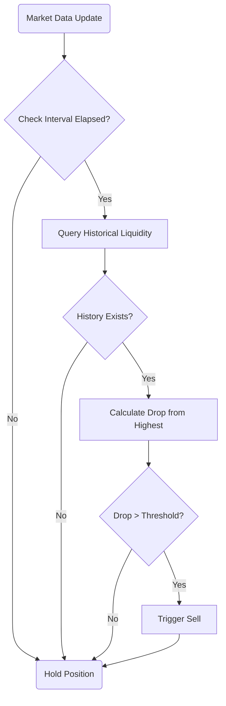

# Liquidity Drop Strategy Flow

This document outlines the workflow and decision process of the liquidity drop strategy.

## Strategy Overview

The liquidity drop strategy monitors token liquidity and automatically triggers a sell when liquidity drops below a configured threshold from its highest point. This helps protect against sudden liquidity crises or potential rug pulls.

## Flow Diagram



## Component Details

1. **Market Data Source**
   - Uses existing market data from SimulationService
   - Data already stored in token_tracking table
   - No duplicate monitoring or storage needed

2. **Interval Check**
   - Uses BaseStrategy's interval tracking
   - Ensures minimum time between checks (configurable)
   - Prevents rapid fluctuations from triggering false sells

3. **Historical Data**
   - Queries token_tracking table for highest liquidity
   - Leverages existing database records
   - No separate state management needed

4. **Drop Calculation**
   - Formula: ((highest - current) / highest) * 100
   - Uses MAX(liquidity_usd) from database
   - Compares against current market data

5. **Threshold Check**
   - Compares drop percentage against configured threshold
   - Default threshold is 20%

6. **Action Triggers**
   - Sell: When drop exceeds threshold
   - Hold: When conditions aren't met

## Configuration Parameters

```typescript
{
  enabled: boolean;         // Enable/disable strategy
  threshold_percent: number; // Drop percentage that triggers sell
  check_interval: number;   // Minimum ms between checks
}
```

## Integration Points

1. **SimulationService**
   - Initializes strategy if enabled in config
   - Provides market data through onMarketData
   - Handles sell execution when triggered

2. **Database Integration**
   - Uses existing token_tracking table
   - Queries historical liquidity data
   - No additional tables or schema changes needed

3. **Price Validation**
   - Works alongside standard price targets
   - Independent of stop-loss/take-profit
   - Uses same data source for consistency

## Optimization Notes

1. **Single Source of Truth**
   - Uses market data already monitored by SimulationService
   - No duplicate monitoring or data storage
   - Consistent with system's existing data flow

2. **Resource Efficiency**
   - Leverages existing database queries
   - Minimal memory footprint (no state tracking)
   - Efficient interval-based checking

3. **Maintainability**
   - Simpler implementation with less state
   - Clear separation of concerns
   - Easier to debug with centralized data