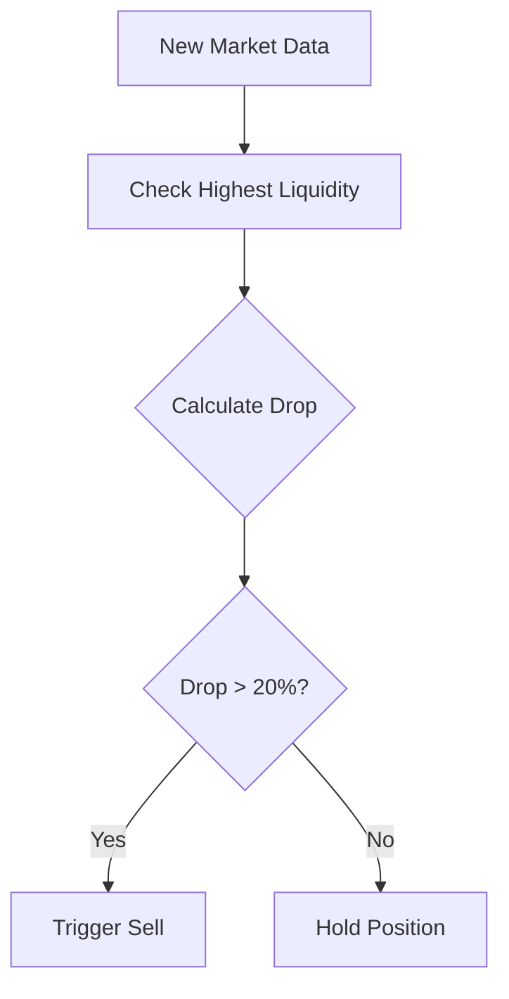

# Liquidity Drop Rule

## Overview
The liquidity drop rule is a protective mechanism that automatically triggers a sell when a token's liquidity significantly decreases from its highest recorded value. This helps protect against rug pulls and sudden liquidity crises.

## How It Works

### 1. Data Source
- Uses DexScreener API data via SimulationService
- Monitors liquidity_usd value from Raydium pairs
- Data is stored in token_tracking table

### 2. Monitoring Process


### 3. Drop Calculation
```typescript
dropPercent = ((highestLiquidity - currentLiquidity) / highestLiquidity) * 100
```

Example:
- Highest liquidity: $100,000
- Current liquidity: $75,000
- Drop = ((100,000 - 75,000) / 100,000) * 100 = 25%
- Result: Triggers sell (25% > 20% threshold)

## Configuration

In src/config.ts:
```typescript
strategies: {
  liquidity_drop: {
    enabled: true,       // Enable/disable the rule
    threshold_percent: 20 // Sell if liquidity drops by this percentage
  }
}
```

Note: The rule uses paper_trading.real_data_update (5000ms) from main config for monitoring interval.

## Key Features

1. **Automatic Highest Point Tracking**
   - Continuously monitors through token_tracking table
   - Automatically updates highest point when new highs are reached
   - Uses database MAX() function for reliable tracking

2. **Real-Time Monitoring**
   - Checks every 5 seconds (configurable via real_data_update)
   - Part of the main price tracking cycle
   - No additional API calls needed

3. **Smart Signal Generation**
   - Only triggers sell when drop is sustained
   - Uses BaseStrategy's timing controls
   - Clear reason messages for triggered sells

## Integration

1. **With SimulationService**
```typescript
// Monitored as part of price tracking
await checkStrategies({
  token_mint,
  token_name,
  current_price,
  volume_m5,
  marketCap,
  liquidity_usd,  // Used by liquidity rule
  timestamp
});
```

2. **Database Usage**
```sql
-- Query used for highest liquidity
SELECT MAX(liquidity_usd) as highest_liquidity 
FROM token_tracking 
WHERE token_mint = ?
```

## Error Handling

1. **Database Issues**
   - Falls back to HOLD if database unavailable
   - Logs errors without interrupting trading
   - Waits for next cycle to retry

2. **Missing Data**
   - Requires at least one historical data point
   - Skips check if insufficient data
   - Logs warning for monitoring

## Example Scenarios

1. **Normal Operation**
   ```
   Initial Liquidity: $100,000
   Current Liquidity: $90,000
   Drop: 10%
   Action: Hold (below 20% threshold)
   ```

2. **Trigger Scenario**
   ```
   Highest Liquidity: $100,000
   Current Liquidity: $75,000
   Drop: 25%
   Action: Sell (exceeds 20% threshold)
   ```

3. **New High**
   ```
   Previous High: $100,000
   New Liquidity: $120,000
   Action: Update high, continue monitoring
   ```

## Best Practices

1. **Configuration**
   - Set threshold_percent based on market volatility
   - Keep enabled for protection against rug pulls
   - Monitor logs for false triggers

2. **Monitoring**
   - Watch for logs indicating "Liquidity dropped by X%"
   - Check database for liquidity history
   - Verify trigger points in trade history

3. **Maintenance**
   - Regular database maintenance
   - Monitor error logs
   - Review trigger thresholds periodically