# Trading Platform Frontend Architecture

```mermaid
flowchart TD
    subgraph "Core Application"
        Nav[Navigation System]
        Auth[Authentication]
        Settings[Global Settings]
        
        subgraph "Mode Selection"
            MS[Mode Switcher]
            MS -->|Paper| Paper
            MS -->|Real| Real
        end
    end

    subgraph "Shared Components"
        SharedUI[Common UI Elements]
        Charts[Trading Charts]
        TokenSearch[Token Search]
        AlertSystem[Alert System]
        RiskCalc[Risk Calculator]
        
        subgraph "Market Data"
            PriceFeed[Price Feed Service]
            MarketStats[Market Statistics]
            VOL[Volume Analysis]
            LP[Liquidity Pools]
        end
    end

    subgraph "Paper Trading Interface"
        Paper[Paper Trading Mode]
        
        subgraph "Paper Components"
            PV[Virtual Balance]
            PAP[Paper Active Positions]
            PRT[Paper Recent Trades]
            PTS[Paper Trading Stats]
            
            subgraph "Paper Controls"
                PBuy[Paper Buy]
                PSell[Paper Sell]
                PTP[Paper Take Profit]
                PSL[Paper Stop Loss]
                PRisk[Paper Risk Settings]
            end
        end

        subgraph "Paper Backend"
            PDB[(Paper Trading DB)]
            PSim[Simulation Engine]
            PValidation[Trade Validation]
        end
    end

    subgraph "Real Trading Interface"
        Real[Real Trading Mode]
        
        subgraph "Real Components"
            RW[Wallet Connection]
            RAP[Real Active Positions]
            RRT[Real Recent Trades]
            RTS[Real Trading Stats]
            
            subgraph "Real Controls"
                RBuy[Real Buy]
                RSell[Real Sell]
                RTP[Real Take Profit]
                RSL[Real Stop Loss]
                RRisk[Real Risk Settings]
            end
        end

        subgraph "Real Backend"
            RDB[(Real Trading DB)]
            Blockchain[Solana Blockchain]
            SecurityChecks[Security Validation]
        end
    end

    %% Core Connections
    Nav --> MS
    Auth --> Real
    Settings --> Paper
    Settings --> Real

    %% Shared Component Connections
    SharedUI --> Paper
    SharedUI --> Real
    Charts --> Paper
    Charts --> Real
    TokenSearch --> Paper
    TokenSearch --> Real
    AlertSystem --> Paper
    AlertSystem --> Real
    RiskCalc --> Paper
    RiskCalc --> Real

    %% Market Data Connections
    PriceFeed --> Charts
    MarketStats --> Charts
    VOL --> Charts
    LP --> Charts

    %% Paper Trading Flow
    Paper --> PV
    Paper --> PAP
    Paper --> PRT
    Paper --> PTS
    PBuy --> PSim
    PSell --> PSim
    PSim --> PDB
    PValidation --> PSim

    %% Real Trading Flow
    Real --> RW
    Real --> RAP
    Real --> RRT
    Real --> RTS
    RBuy --> SecurityChecks
    RSell --> SecurityChecks
    SecurityChecks --> Blockchain
    Blockchain --> RDB

classDef primary fill:#2374ab,stroke:#2374ab,color:#fff
classDef secondary fill:#ff7e67,stroke:#ff7e67,color:#fff
classDef paper fill:#41b3a3,stroke:#41b3a3,color:#fff
classDef real fill:#e94f37,stroke:#e94f37,color:#fff
classDef shared fill:#393e41,stroke:#393e41,color:#fff

class Nav,Auth,Settings,MS primary
class SharedUI,Charts,TokenSearch,AlertSystem,RiskCalc shared
class Paper,PV,PAP,PRT,PTS,PBuy,PSell,PTP,PSL paper
class Real,RW,RAP,RRT,RTS,RBuy,RSell,RTP,RSL real
class PriceFeed,MarketStats,VOL,LP secondary
```



## Trading Modes Integration

### Shared Infrastructure
1. **Common Components**
   - Market data services
   - Trading charts
   - Token search functionality
   - Alert system
   - Risk calculator

2. **UI Elements**
   - Navigation system
   - Modal components
   - Form elements
   - Notification system

3. **Services**
   - Price feed management
   - Market statistics
   - Volume analysis
   - Liquidity monitoring

### Paper Trading Mode
1. **Specific Components**
   - Virtual balance display
   - Simulated position tracking
   - Paper trading statistics
   - Risk-free practice environment

2. **Features**
   - Simulated order execution
   - Virtual portfolio management
   - Performance tracking
   - Learning tools and guides

3. **Backend Integration**
   - Local database storage
   - Trade simulation engine
   - Market data validation
   - Performance analytics

### Real Trading Mode
1. **Specific Components**
   - Wallet integration
   - Real position management
   - Actual transaction history
   - Live trading statistics

2. **Features**
   - Real order execution
   - Blockchain transaction handling
   - Advanced security measures
   - Real-time balance updates

3. **Backend Integration**
   - Blockchain interaction
   - Security validation
   - Transaction monitoring
   - Real-time position tracking

## Mode Switching
1. **State Management**
   - Clean separation of paper/real trading states
   - Shared market data state
   - Mode-specific UI states

2. **User Experience**
   - Clear mode indicators
   - Confirmation dialogs for mode switching
   - Distinct visual themes per mode
   - Safety warnings for real trading

3. **Data Handling**
   - Isolated storage per mode
   - Shared market analysis data
   - Mode-specific transaction logs
   - Separate performance metrics

## Security Considerations
1. **Paper Trading**
   - Simulated transactions only
   - No wallet connection required
   - Focus on learning and strategy testing

2. **Real Trading**
   - Wallet connection required
   - Transaction signing validation
   - Multiple security checks
   - Risk management enforcement

## Implementation Guidelines

### Frontend Structure
```typescript
// Mode-specific interfaces
interface TradingMode {
  type: 'paper' | 'real';
  components: {
    positions: typeof Position;
    trades: typeof TradeHistory;
    controls: typeof TradingControls;
    stats: typeof Statistics;
  };
  services: {
    orderExecution: typeof OrderService;
    riskManagement: typeof RiskService;
    validation: typeof ValidationService;
  };
}

// Shared component base classes
abstract class Position {
  abstract update(): void;
  abstract calculate(): void;
}

abstract class TradeHistory {
  abstract fetch(): void;
  abstract display(): void;
}

// Mode-specific implementations
class PaperPosition extends Position {
  // Simulated position handling
}

class RealPosition extends Position {
  // Real blockchain position handling
}
```

### State Management
```typescript
interface TradingState {
  mode: 'paper' | 'real';
  shared: {
    marketData: MarketData;
    userSettings: Settings;
  };
  paper: PaperTradingState;
  real: RealTradingState;
}
```

### Mode Switching Logic
```typescript
class ModeManager {
  switchMode(newMode: 'paper' | 'real') {
    // Cleanup current mode
    // Initialize new mode
    // Update UI
    // Reset relevant state
  }
}
```

This architecture ensures a clear separation between paper and real trading while maintaining a cohesive user experience through shared components and services. The mode-specific implementations handle their unique requirements while presenting a consistent interface to the user.