# Complete Technical Architecture

```mermaid
graph TB
    %% Root Project Structure
    subgraph Project_Root["Project Root"]
        Config[".env, package.json, tsconfig.json"]
        Linting["eslint.config.mjs"]
        Tests["jest.config.mjs, jest.setup.cjs"]
        Docs["README.md, Instructions.md"]
        Git[".gitignore, .gitattributes"]
    end

    %% Source Code Organization
    subgraph Source["src/"]
        direction TB
        
        %% Core System Components
        subgraph Core["Core System"]
            EntryPoint["index.ts"]
            Types["types.ts"]
            ConfigManager["config.ts"]
            Transactions["transactions.ts"]
        end

        %% Paper Trading Module
        subgraph PaperTrading["papertrading/"]
            PaperCore["paper_trading.ts"]
            PriceValidation["price_validation.ts"]
            
            subgraph CLI["cli/"]
                DashOps["dashboard-operations.ts"]
                PaperDash["paper-trading-dashboard.ts"]
                TableDisplay["table-display.ts, table-renderer.ts"]
                CLITypes["types.ts"]
                
                subgraph Displays["displays/"]
                    BalanceDisplay["balance-display.ts"]
                    PositionDisplay["position-display.ts"]
                    StatsDisplay["stats-display.ts"]
                    TradesDisplay["trades-display.ts"]
                end
                
                subgraph Config["config/"]
                    DashStyle["dashboard_style.ts"]
                end
                
                subgraph Services["services/"]
                    DashData["dashboard-data.ts"]
                end
                
                subgraph Utils["utils/"]
                    ANSI["ansi.ts"]
                    StringWidth["string-width.ts"]
                end
            end
            
            subgraph DB["db/"]
                ConnManager["connection_manager.ts"]
                DBIndex["index.ts"]
            end
            
            subgraph PaperServices["services/"]
                Simulation["simulation.ts"]
                ServicesIndex["index.ts"]
            end
            
            subgraph Strategies["strategies/"]
                BaseStrategy["base-strategy.ts"]
                LiquidityDrop["liquidity-drop.ts"]
                StrategyTypes["types.ts"]
            end
        end

        %% Rugcheck Module
        subgraph Rugcheck["rugcheck/"]
            RugFactory["factory.ts"]
            RugIndex["index.ts"]
            RugTypes["types.ts"]
            RugValidation["validation.ts"]
            
            subgraph Providers["providers/"]
                subgraph RugcheckXYZ["rugcheck-xyz/"]
                    Provider["provider.ts"]
                    ProviderTypes["types.ts"]
                    ValidationRules["validation-rules.ts"]
                    
                    subgraph Validation["validation/"]
                        Content["content.ts"]
                        Holders["holders.ts"]
                        Market["market.ts"]
                        Metadata["metadata.ts"]
                        Scoring["scoring.ts"]
                        ValidationTypes["types.ts"]
                    end
                end
            end
        end

        %% Tracker Module
        subgraph Tracker["tracker/"]
            TrackerDB["db.ts"]
            TrackerIndex["index.ts"]
        end

        %% Utils Module
        subgraph Utils["utils/"]
            Decimal["decimal.ts"]
            EnvValidator["env-validator.ts"]
            Keys["keys.ts"]
        end
    end

    %% Documentation
    subgraph Documentation["Strategies_Docs/"]
        MainDocs["index.md"]
        subgraph LiquidityDocs["liquidityDrop/"]
            LiqFlow["liquidity-drop-flow.md"]
            LiqRule["liquidity-drop-rule.md"]
        end
    end

    %% External Services
    subgraph External["External Services"]
        Solana["Solana Blockchain"]
        Jupiter["Jupiter V6 Swap API"]
        RugcheckAPI["Rugcheck.xyz API"]
        Dexscreener["Dexscreener API"]
        HeliusRPC["Helius RPC Node"]
    end

    %% Internal Dependencies
    Core -- "Uses" --> Utils
    PaperTrading -- "Uses" --> Core
    PaperTrading -- "Uses" --> Utils
    Rugcheck -- "Uses" --> Core
    Tracker -- "Uses" --> Core
    CLI -- "Uses" --> PaperServices
    CLI -- "Uses" --> DB
    Strategies -- "Uses" --> PaperServices

    %% External Dependencies
    Core -- "Interacts" --> Solana
    Core -- "Swaps" --> Jupiter
    Rugcheck -- "Validates" --> RugcheckAPI
    PaperTrading -- "Price Data" --> Dexscreener
    Core -- "RPC Calls" --> HeliusRPC

    %% Deployment Pipeline
    subgraph Build["Build & Deploy"]
        NPM["package.json Scripts"]
        ESLint["ESLint Config"]
        Jest["Jest Tests"]
        TSConfig["TypeScript Config"]
    end

    %% Style Classes
    classDef core fill:#f9f,stroke:#333,stroke-width:2px
    classDef module fill:#bbf,stroke:#333,stroke-width:2px
    classDef service fill:#bfb,stroke:#333,stroke-width:2px
    classDef config fill:#fbb,stroke:#333,stroke-width:2px
    classDef external fill:#ff9,stroke:#333,stroke-width:2px
    
    class Core core
    class PaperTrading,Rugcheck,Tracker,Utils module
    class External service
    class Config,Build config
    class Solana,Jupiter,RugcheckAPI,Dexscreener,HeliusRPC external
```

## Legend

1. **Colors**
   - Pink (core): Core system components
   - Light Blue (module): Main application modules
   - Light Green (service): Internal services
   - Light Red (config): Configuration and build files
   - Light Yellow (external): External services and APIs

2. **Arrows**
   - Solid lines: Direct dependencies
   - "Uses": Internal module dependencies
   - "Interacts/Swaps/Validates/etc.": External service interactions

3. **Subgraphs**
   - Project_Root: Configuration and documentation files
   - Source: Main application source code
   - Documentation: Project documentation and guides
   - External: Third-party services and APIs
   - Build: Build and deployment configuration

## Key Components

1. **Core System**
   - Entry points and configuration
   - Type definitions
   - Transaction management

2. **Paper Trading Module**
   - Trading simulation
   - Price validation
   - CLI dashboard
   - Database management
   - Trading strategies

3. **Rugcheck Module**
   - Token validation
   - Provider integration
   - Scoring system

4. **Tracker Module**
   - Portfolio tracking
   - Database management

5. **Utils Module**
   - Shared utilities
   - Environment validation
   - Key management

## Build & Deployment

- TypeScript configuration
- ESLint for code quality
- Jest for testing
- NPM scripts for build and deployment

## External Integrations

- Solana blockchain interaction
- Jupiter swap API integration
- Rugcheck.xyz API for validation
- Dexscreener for price data
- Helius RPC node for blockchain queries