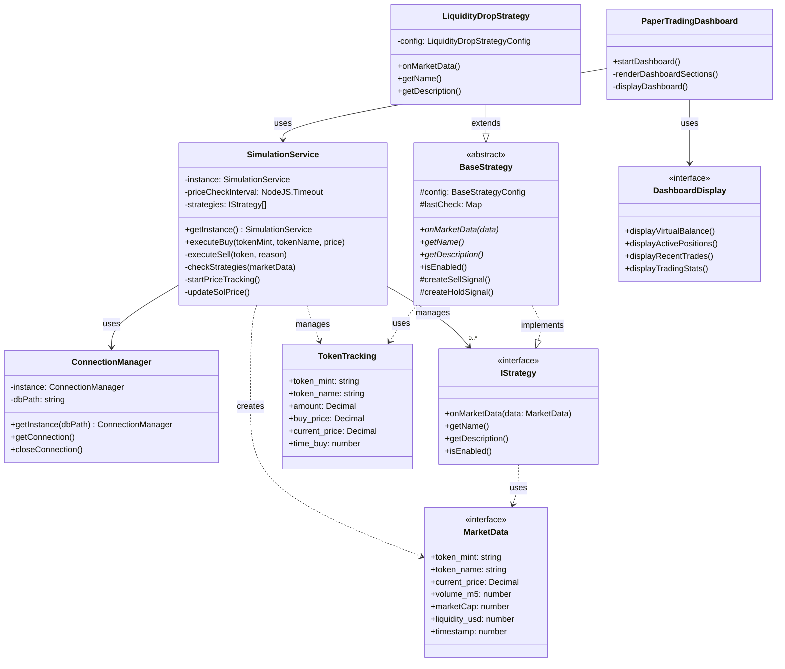

# Paper Trading System Architecture

The paper trading system is structured using several key modules that work together to provide paper trading functionality. Below is a class diagram showing the relationships between these components.

## Component Descriptions

### Core Service Layer
- **SimulationService**: Singleton service managing paper trading simulation, market data updates, and trading strategy execution
- **ConnectionManager**: Singleton managing database connections and operations

### Strategy Pattern Implementation
- **IStrategy**: Interface defining contract for trading strategies
- **BaseStrategy**: Abstract base class implementing common strategy functionality
- **LiquidityDropStrategy**: Concrete strategy implementation for liquidity-based trading

### CLI Interface
- **PaperTradingDashboard**: Main dashboard interface displaying trading information
- **DashboardDisplay**: Interface for different dashboard display components

### Data Models
- **MarketData**: Interface representing current market conditions
- **TokenTracking**: Interface representing tracked token positions

## Key Design Patterns
1. **Singleton Pattern**: Used in SimulationService and ConnectionManager to ensure single instance
2. **Strategy Pattern**: Used for implementing different trading strategies
3. **Observer Pattern**: Used in price tracking and market data updates
4. **Facade Pattern**: CLI dashboard provides simplified interface to complex trading system

## Data Flow
1. SimulationService periodically fetches market data for tracked tokens
2. Market data is passed through configured trading strategies
3. Strategies analyze data and may trigger trading signals
4. Trading operations are simulated and recorded in the database
5. Dashboard components observe and display updated trading information