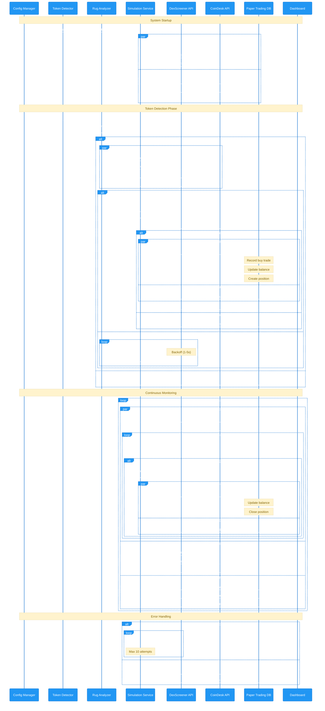

# Paper Trading Flow - Solana Token Sniper

## Overview
This document details the step-by-step flow of paper trading operations in the Solana Token Sniper system. For detailed implementation specifications, see [paperTrading.md](./paperTrading.md).

## Complete System Flow


## Database Schema & Operations

### Core Tables
```sql
-- Virtual Balance
CREATE TABLE virtual_balance (
    id INTEGER PRIMARY KEY AUTOINCREMENT,
    balance_sol TEXT NOT NULL,
    updated_at INTEGER NOT NULL
);

-- Simulated Trades
CREATE TABLE simulated_trades (
    id INTEGER PRIMARY KEY AUTOINCREMENT,
    token_name TEXT NOT NULL,
    token_mint TEXT NOT NULL,
    amount_sol TEXT NOT NULL,
    amount_token TEXT NOT NULL,
    buy_price TEXT NOT NULL,
    buy_fees TEXT NOT NULL,
    buy_slippage TEXT DEFAULT '0',
    sell_price TEXT DEFAULT NULL,
    sell_fees TEXT DEFAULT NULL,
    sell_slippage TEXT DEFAULT '0',
    time_buy INTEGER NOT NULL,
    time_sell INTEGER DEFAULT NULL,
    volume_m5 TEXT DEFAULT '0',
    market_cap TEXT DEFAULT '0',
    liquidity_buy_usd TEXT DEFAULT '0',
    liquidity_sell_usd TEXT DEFAULT NULL,
    pnl TEXT DEFAULT NULL
);

-- Token Tracking
CREATE TABLE token_tracking (
    id INTEGER PRIMARY KEY AUTOINCREMENT,
    token_mint TEXT UNIQUE NOT NULL,
    token_name TEXT NOT NULL,
    amount TEXT NOT NULL,
    buy_price TEXT NOT NULL,
    current_price TEXT NOT NULL,
    last_updated INTEGER NOT NULL,
    stop_loss TEXT NOT NULL,
    take_profit TEXT NOT NULL,
    volume_m5 REAL DEFAULT 0,
    market_cap REAL DEFAULT 0,
    liquidity_usd REAL DEFAULT 0,
    position_size_sol TEXT DEFAULT '0'
);
```

## Trade Validation & Testing

### 1. Position Management `🟢`
```typescript
// Position limits
max_open_positions: 5,

// Validation checks
✓ Current positions < max_limit
✓ Sufficient balance available
✓ Valid token address
✓ Market data available
```

### 2. Price Trigger Calculations `🟡`
```typescript
// Stop Loss calculation
stopLossPrice = buyPrice * (1 - stop_loss_percent/100)

// Take Profit calculation
takeProfitPrice = buyPrice * (1 + take_profit_percent/100)

// Trigger validation
if (currentPrice <= stopLossPrice || currentPrice >= takeProfitPrice) {
    trigger_sale();
}
```

## System Validation Points

### 1. Buy Operation Validations `🟢`
```typescript
// Pre-trade checks
✓ Token address validation
✓ Price data availability
✓ Position limit check
✓ Balance sufficiency

// Post-trade verification
✓ Position created
✓ Balance updated
✓ Fees recorded
✓ Slippage within limits
```

### 2. Price Tracking Validations `🟡`
```typescript
// Market data verification
✓ Price in valid range
✓ Volume data available
✓ Liquidity metrics present
✓ Market cap validation

// Update frequency
✓ Price updates < 60s
✓ Market data refresh < 5m
```

## Error Handling & Recovery

### 1. Connection Management `🔴`
```typescript
try {
    const db = await connectionManager.getConnection();
    // Execute operations
} catch (error) {
    console.error('Connection error:', error);
    return null;
} finally {
    await connectionManager.releaseConnection(db);
}
```

### 2. Transaction Recovery `🔵`
```typescript
// Handle incomplete transactions
async function recoverTransactions() {
    ✓ Find pending transactions
    ✓ Verify last known state
    ✓ Apply or rollback changes
    ✓ Update affected positions
}
```

### 3. Price Update Recovery `🟡`
```typescript
// Retry logic
let retries = 0;
while (retries < maxRetries) {
    try {
        await updateTokenPrice(token);
        break;
    } catch (error) {
        retries++;
        await delay(backoffTime);
    }
}
```

## System Health Checks

### 1. Database Health `🔵`
```typescript
// Regular validation checks
✓ Connection pool status
✓ Transaction throughput
✓ Query performance
✓ Storage utilization
```

### 2. Data Integrity `🟢`
```typescript
// Continuous monitoring
✓ Balance reconciliation
✓ Position verification
✓ Price data freshness
✓ Transaction completeness
```

### 3. API Services `🟡`
```typescript
// External service health
✓ DexScreener API status
✓ CoinDesk API latency
✓ Rate limit monitoring
✓ Data quality checks
```

## Configuration

```typescript
paper_trading: {
    // Core settings
    initial_balance: 1,          // Initial SOL
    dashboard_refresh: 5000,     // Update rate (ms)
    real_data_update: 60000,    // Market data refresh
    verbose_log: false,         // Detailed logging
    
    // Price monitoring
    price_check: {
        max_retries: 10,
        initial_delay: 1000,
        max_delay: 5000
    },
    
    // Trade settings
    swap: {
        amount: 10000000,        // 0.01 SOL
        max_open_positions: 5,
        slippageBps: 200         // 2% slippage
    }
}
```

## Testing Scenarios

### 1. Position Limit Testing `🔵`
```typescript
// Fill max positions
for (i = 0; i < max_positions; i++) {
    expect(buy_operation).toSucceed()
}
// Verify additional buy fails
expect(buy_operation).toFail()
```

### 2. Price Update Testing `🟡`
```typescript
// Buy at initial price
initial_price = 0.000100
expect(buy_operation).toSucceed()

// Update price +25%
new_price = initial_price * 1.25
expect(update_price).toSucceed()
expect(position.current_price).toEqual(new_price)
```

### 3. Complete Cycle Testing `🟢`
```typescript
// Execute complete buy-sell cycle
✓ Initial buy succeeds
✓ Position properly tracked
✓ Price updates reflected
✓ Triggers properly set
✓ Final balance increased
```

## Performance Metrics

### 1. Response Time Tracking `🟡`
```typescript
// Target metrics
API_call_timeout: 5000,      // 5s
price_update_interval: 60000, // 60s
db_operation_timeout: 1000    // 1s
```

### 2. Success Rate Monitoring `🟢`
```typescript
// Track success rates
✓ API call success rate
✓ Trade execution success
✓ Trigger execution timing
✓ Database operation completion
```

## Cross-References

For detailed implementation specifications, see:
- [paperTrading.md](./paperTrading.md) - Core implementation details
- [frontend-architecture.md](./frontend-architecture.md) - UI components
- [systemPatterns.md](./systemPatterns.md) - System design patterns

## Color Code Legend

- 🔵 **Blue**: Core system operations
- 🟢 **Green**: Success paths and validations
- 🟡 **Yellow**: Monitoring and tracking operations
- 🔴 **Red**: Error paths and warnings

This documentation provides a comprehensive overview of the paper trading system's operational flow, validation procedures, and monitoring aspects while ensuring reliable system performance and data integrity.