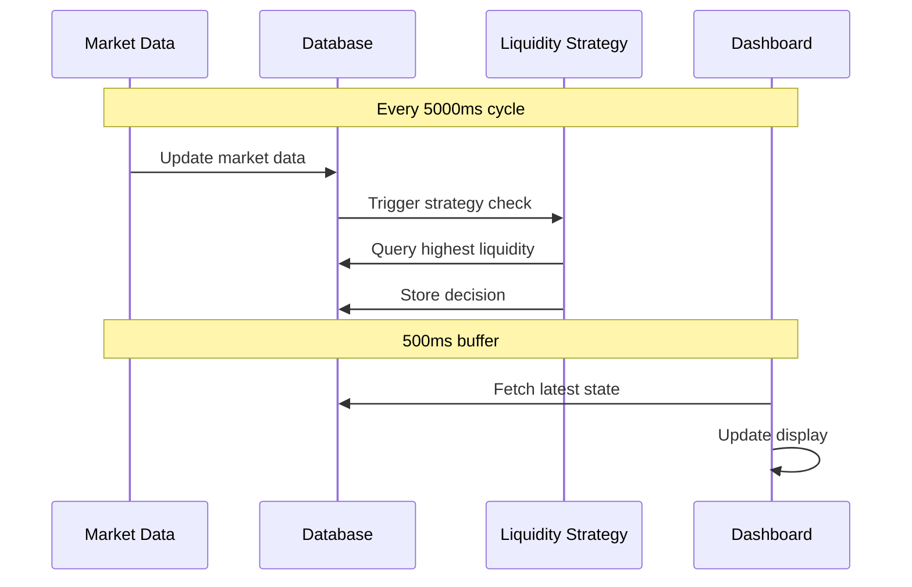

# Timing Analysis: Dashboard and Liquidity Strategy

## Timing Configuration

### Synchronized Intervals
```typescript
paper_trading: {
  real_data_update: 5000,    // Base interval - Market data & strategy updates
  dashboard_refresh: 5500,    // Slightly delayed dashboard refresh
}
```

### Why This Works Better

1. **Sequence of Operations**
```
Time 0ms:      Market data update starts
Time ~4900ms:  Market data & strategy checks complete
Time 5000ms:   Next market data update begins
Time 5500ms:   Dashboard refresh shows latest data
```

2. **Benefits**
- Dashboard always shows complete updates
- No partial/incomplete data displayed
- Reduced database contention
- Stable display without flickering

## Data Flow Timeline



## Performance Considerations

1. **Update Cycle (5000ms)**
   - Market data fetched & stored
   - Strategy checks performed
   - Database writes completed

2. **Display Cycle (5500ms)**
   - 500ms buffer ensures data consistency
   - Reads complete data set
   - Avoids race conditions

3. **Resource Usage**
   - Reduced database contention
   - No overlapping operations
   - Clear operation windows

## Error Prevention

1. **Race Conditions Avoided**
   ```
   [Market Update]   [Strategy Check]   [DB Write]   [Buffer]   [Dashboard Read]
   |----------------|-----------------|------------|----------|------------------|
   0ms             2000ms           4000ms       5000ms     5500ms            
   ```

2. **Database Access Pattern**
   - Writes complete before reads
   - Clear separation of operations
   - Predictable load pattern

## Monitoring Guidelines

1. **Healthy Operation Signs**
   - Market data updates every 5 seconds
   - Dashboard refreshes show complete data
   - No partial updates visible

2. **Warning Signs**
   - Dashboard showing stale data
   - Flickering updates
   - Missing market data

3. **Troubleshooting**
   - Check system time synchronization
   - Monitor database operation timing
   - Verify strategy execution time

## Configuration Notes

1. **Minimum Settings**
```typescript
real_data_update >= 5000  // Minimum 5s for stable operation
dashboard_refresh = real_data_update + 500  // Add buffer
```

2. **Adjusting Values**
   - Increase both if system is under heavy load
   - Maintain the buffer between updates
   - Monitor system performance after changes

3. **Testing Changes**
   - Verify complete data display
   - Check strategy execution timing
   - Monitor database performance