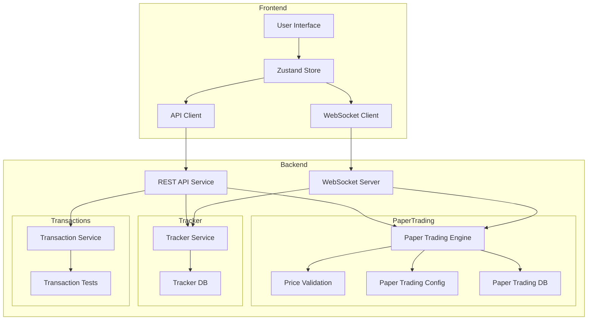
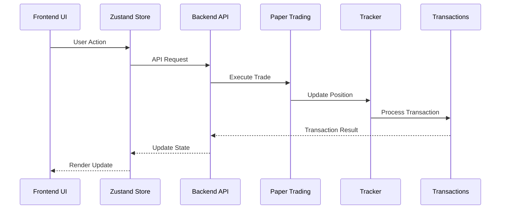

# Complete System Architecture - Solana Trading Bot

## System Overview



## Component Details

### Frontend Components

1. **User Interface**
   - React 18 with TypeScript
   - TailwindCSS for styling
   - Chart.js for visualizations
   - Components:
     - Header (Mode Selector, Balance, Controls)
     - Trading Dashboard
     - Position Manager
     - Configuration Panel

2. **State Management**
   - Zustand Store
   - Manages:
     - Trading Mode (Paper/Real)
     - Positions
     - Trade History
     - Performance Metrics

3. **API Client**
   - React Query for data fetching
   - Handles:
     - Trading operations
     - Configuration updates
     - Historical data retrieval

4. **WebSocket Client**
   - Real-time updates for:
     - Price changes
     - Position updates
     - Trade executions

### Backend Components

1. **Paper Trading Engine**
   - Core Features:
     - Virtual balance management
     - Position tracking
     - Trade execution simulation
   - Services:
     - Price validation
     - Configuration management
     - Database operations

2. **Tracker Service**
   - Functionality:
     - Market data tracking
     - Position monitoring
     - Performance analytics
   - Database:
     - Trade history
     - Market data storage

3. **Transaction Service**
   - Features:
     - Transaction processing
     - Order management
     - Test coverage

4. **API Service**
   - REST endpoints for:
     - Trading operations
     - Configuration management
     - Data retrieval
   - WebSocket server for real-time updates

## Data Flow



## File Structure

```
├── src/
│   ├── papertrading/           # Paper Trading Engine
│   │   ├── cli/                # Command Line Interface
│   │   ├── config/             # Configuration Management
│   │   ├── db/                 # Database Operations
│   │   ├── services/           # Trading Services
│   │   ├── paper_trading.ts    # Core Engine
│   │   └── price_validation.ts # Price Validation
│   │
│   ├── tracker/                # Market Tracking
│   │   ├── __tests__/         # Test Files
│   │   ├── db.ts              # Database Operations
│   │   └── index.ts           # Main Entry
│   │
│   ├── transactions/           # Transaction Processing
│   │   ├── __tests__/         # Test Files
│   │   └── index.ts           # Main Entry
│   │
│   └── utils/                  # Shared Utilities
│       ├── __tests__/         # Test Files
│       ├── decimal.ts         # Decimal Operations
│       ├── env-validator.ts   # Environment Validation
│       └── keys.ts            # Key Management
│
└── frontend/                   # Frontend Application
    ├── src/
    │   ├── components/         # Reusable Components
    │   ├── features/           # Feature Components
    │   ├── hooks/             # Custom Hooks
    │   ├── services/          # API Services
    │   ├── store/             # State Management
    │   ├── types/             # TypeScript Types
    │   └── utils/             # Utility Functions
    │
    └── public/                 # Static Assets
```

## Integration Points

1. **Frontend to Backend**
   - REST API endpoints
   - WebSocket connections
   - Authentication flow

2. **Paper Trading to Tracker**
   - Position updates
   - Market data flow
   - Performance metrics

3. **Tracker to Transactions**
   - Order processing
   - Transaction validation
   - State updates

## Security Measures

1. **Frontend Security**
   - Mode switching validation
   - Input sanitization
   - Rate limiting

2. **Backend Security**
   - API authentication
   - Request validation
   - Data encryption

3. **Data Security**
   - Secure WebSocket connections
   - Database encryption
   - Environment variable protection

## Testing Strategy

1. **Frontend Testing**
   - Component tests
   - Integration tests
   - End-to-end tests

2. **Backend Testing**
   - Unit tests for each service
   - Integration tests
   - Performance testing

3. **System Testing**
   - Full flow testing
   - Load testing
   - Security testing