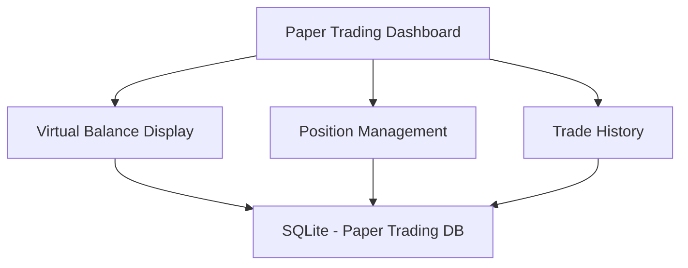
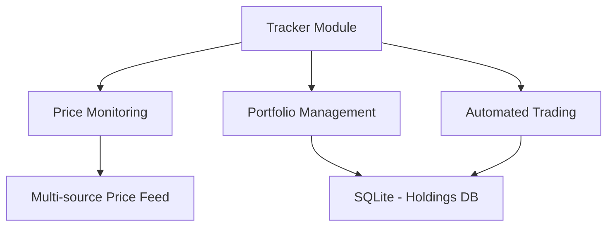

# Tracker Integration Plan

## Overview

This plan outlines how to integrate the tracker module with the paper trading dashboard to enable a unified trading interface supporting both paper and real trading modes.

## Current Architecture Analysis

### Paper Trading Dashboard


### Tracker Module


## Integration Architecture

### 1. Unified Dashboard Structure

```typescript
interface UnifiedDashboard {
  mode: 'paper' | 'real';
  displays: {
    balance: BalanceDisplayBase;
    positions: PositionDisplayBase;
    trades: TradeHistoryBase;
    marketData: MarketDataDisplay;
  };
  services: {
    paper: PaperTradingService;
    real: RealTradingService;
    price: PriceValidationService;
  };
}

// Base display components with mode-specific implementations
abstract class BalanceDisplayBase {
  constructor(protected mode: 'paper' | 'real') {}
  abstract fetchBalance(): Promise<Balance>;
  abstract render(): void;
}

class PaperBalanceDisplay extends BalanceDisplayBase {
  async fetchBalance() {
    return this.services.paper.getVirtualBalance();
  }
}

class RealBalanceDisplay extends BalanceDisplayBase {
  async fetchBalance() {
    return this.services.real.getHoldingsBalance();
  }
}
```

### 2. Database Integration

```typescript
// Unified schema interface
interface TradeRecord {
  id: number;
  timestamp: number;
  tokenMint: string;
  tokenName: string;
  amount: string;
  priceUSD: string;
  type: 'BUY' | 'SELL';
  mode: 'paper' | 'real';
}

// Database service factory
class DatabaseServiceFactory {
  static create(mode: 'paper' | 'real'): DatabaseService {
    return mode === 'paper'
      ? new PaperTradingDB(config.swap.db_name)
      : new RealTradingDB(config.swap.db_name_tracker_holdings);
  }
}
```

### 3. Price Validation Integration

```typescript
// Enhanced price validator supporting both modes
class UnifiedPriceValidator extends PriceValidator {
  constructor(mode: 'paper' | 'real', config: PriceValidationConfig) {
    super(config);
    this.mode = mode;
    this.slippageConfig = mode === 'paper' 
      ? config.paper.slippage 
      : config.real.slippage;
  }

  // Override validation rules based on mode
  validatePrice(price: number, source: 'jupiter' | 'dexscreener'): ValidationResult {
    const baseValidation = super.validatePrice(price, source);
    
    if (this.mode === 'real') {
      // Add additional validation for real trading
      return this.enhanceValidation(baseValidation);
    }
    
    return baseValidation;
  }
}
```

### 4. Trade Execution Integration

```typescript
// Trade service interface
interface TradeService {
  executeBuy(params: TradeParams): Promise<TradeResult>;
  executeSell(params: TradeParams): Promise<TradeResult>;
  getTrades(limit?: number): Promise<Trade[]>;
  getPositions(): Promise<Position[]>;
}

// Mode-specific implementations
class PaperTradeService implements TradeService {
  // Implementation using paper trading simulation
}

class RealTradeService implements TradeService {
  // Implementation using tracker and real transactions
}
```

### 5. Market Data Integration

```typescript
class MarketDataService {
  private priceFeeds: {
    jupiter: JupiterPriceFeed;
    dexscreener: DexScreenerFeed;
  };

  async getTokenPrice(token: string): Promise<PriceData> {
    const jupiterPrice = await this.priceFeeds.jupiter.getPrice(token);
    const dexPrice = await this.priceFeeds.dexscreener.getPrice(token);
    
    return this.validator.validateAndSelectPrice(jupiterPrice, dexPrice);
  }
}
```

## Implementation Phases

### Phase 1: Infrastructure Setup (Week 1)
1. Create unified dashboard base structure
2. Implement mode switching mechanism
3. Set up shared database interface
4. Create unified price validation service

### Phase 2: Component Migration (Week 2)
1. Refactor paper trading components to use base classes
2. Create real trading component implementations
3. Set up unified state management
4. Implement shared market data service

### Phase 3: Trading Integration (Week 3)
1. Create unified trade execution interface
2. Implement real trading service
3. Add automated trading features
4. Set up position management

### Phase 4: UI Enhancement (Week 4)
1. Create mode-specific displays
2. Add real-time price updates
3. Implement portfolio overview
4. Add transaction history view

### Phase 5: Testing & Optimization (Week 5)
1. Add integration tests
2. Implement error handling
3. Add performance monitoring
4. Create user documentation

## Security Considerations

1. **Mode Switching**
   - Require explicit confirmation for real trading
   - Validate wallet connection
   - Clear sensitive data on mode switch

2. **Trade Validation**
   - Additional checks for real trades
   - Double confirmation for large orders
   - Balance verification before execution

3. **Error Handling**
   - Graceful fallback mechanisms
   - Clear error reporting
   - Automatic recovery where possible

## Performance Optimizations

1. **Real-time Updates**
   - Implement WebSocket connections
   - Add data caching layer
   - Optimize render cycles

2. **Database Operations**
   - Connection pooling
   - Query optimization
   - Batch operations

## Testing Strategy

1. **Unit Tests**
   ```typescript
   describe('UnifiedDashboard', () => {
     test('should switch modes safely', async () => {
       const dashboard = new UnifiedDashboard();
       await dashboard.switchMode('real');
       expect(dashboard.currentMode).toBe('real');
       expect(dashboard.services.current).toBeInstanceOf(RealTradeService);
     });
   });
   ```

2. **Integration Tests**
   ```typescript
   describe('Trade Execution', () => {
     test('should execute trades in correct mode', async () => {
       const service = await TradeServiceFactory.create('paper');
       const result = await service.executeBuy({
         token: 'SOL',
         amount: '1.0',
         price: '100'
       });
       expect(result.success).toBe(true);
       expect(result.mode).toBe('paper');
     });
   });
   ```

## Migration Path

1. **Code Organization**
   ```
   src/
   ├── shared/           # Shared components and utilities
   ├── papertrading/    # Paper trading specific code
   ├── realtrading/    # Real trading specific code
   └── unified/        # New unified components
   ```

2. **Data Migration**
   - Create data migration scripts
   - Add schema version tracking
   - Implement rollback capabilities

## Monitoring and Logging

1. **Performance Metrics**
   - Trade execution time
   - Price update latency
   - Database operation timing
   - Memory usage tracking

2. **Error Tracking**
   - Detailed error logging
   - Real-time alerts for critical issues
   - Performance degradation warnings

## Documentation Requirements

1. **Technical Documentation**
   - Architecture overview
   - Component interaction diagrams
   - Database schema documentation
   - API specifications

2. **User Documentation**
   - Mode switching guide
   - Trading interface manual
   - Security best practices
   - Troubleshooting guide

This integration plan provides a comprehensive approach to combining the paper trading dashboard with the tracker module while maintaining a clean separation of concerns and ensuring robust operation in both modes.