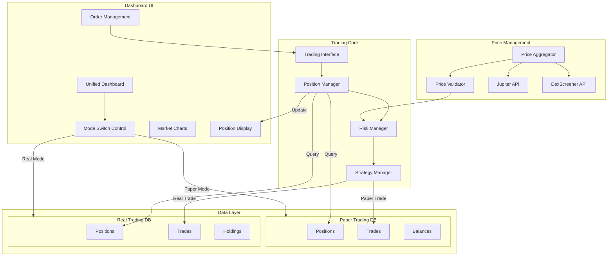

# Tracker & Paper Trading Integration Plan

## Overview
Plan to integrate the real trading tracker functionality with the paper trading system, allowing unified dashboard display and shared functionality while maintaining separation between simulation and real trading modes.

## System Flow Diagram



## Current System Analysis

### Tracker System (Real Trading)
- Maintains real token holdings and positions
- Uses SQLite for position tracking
- Has price validation from multiple sources (Jupiter, DexScreener)
- Executes real take-profit/stop-loss orders
- Basic console-based display

### Paper Trading System
- Simulated trading environment
- Advanced dashboard UI
- Strategy implementation framework
- Price validation capabilities
- Portfolio tracking and analytics

## Integration Strategy

### 1. Unified Trading Interface

Create an abstract trading interface that both systems can implement:

```typescript
interface TradingSystem {
  // Position Management
  getOpenPositions(): Position[];
  executeOrder(order: Order): Promise<OrderResult>;
  updatePosition(position: Position): Promise<void>;
  
  // Price Management  
  getCurrentPrice(token: string): Promise<PriceInfo>;
  validatePrice(price: number, source: string): ValidationResult;
  
  // Portfolio Analytics
  calculatePnL(): PortfolioMetrics;
  getTradeHistory(): Trade[];
}
```

### 2. Database Standardization

Standardize database schemas between paper trading and real trading:
- Use same table structure for positions
- Add mode flag to distinguish real vs paper trades
- Share price validation data

### 3. Dashboard Integration

Modify paper trading dashboard to:
- Accept trading system implementation as parameter
- Display real/paper mode indicator
- Share display components between modes
- Add real-trade specific indicators

### 4. Strategy Framework Integration

Enable tracker to use paper trading strategy framework:
- Make strategies mode-aware
- Add real-trade safety checks
- Share backtesting capabilities
- Allow strategy validation in paper mode before real deployment

### 5. Price Validation Enhancement

Unify price validation:
- Share validation logic
- Add multi-source aggregation to paper trading
- Implement confidence scoring
- Add historical price comparison

## Implementation Phases

### Phase 1: Infrastructure
1. Create unified interfaces
2. Standardize database schemas
3. Add mode switching capability
4. Share core utilities

### Phase 2: Dashboard Integration  
1. Modify dashboard for multi-mode support
2. Add real trading displays
3. Implement mode switching UI
4. Share analytics components

### Phase 3: Strategy Integration
1. Update strategy framework for real trading
2. Add safety validations
3. Implement strategy testing workflow
4. Create strategy migration path

### Phase 4: Testing & Validation
1. Create test suite for both modes
2. Validate mode isolation
3. Test mode switching
4. Verify data separation

## Safety Considerations

1. Mode Isolation
- Clear mode indicators
- Separate databases
- Validation checks
- Confirmation dialogs

2. Risk Management
- Additional validations for real trades
- Automated safety checks
- Clear error handling
- Audit logging

3. Data Integrity
- Transaction validation
- State verification
- Backup procedures
- Recovery processes

## Next Steps

1. Begin with unified interface implementation
2. Create database migration plan
3. Modify dashboard for dual-mode support
4. Test mode switching safety
5. Implement strategy framework changes
6. Add comprehensive testing

## Open Questions

1. How to handle partial order fills in real trading?
2. Should historical data be shared between modes?
3. How to manage different price sources between modes?
4. What additional safety checks are needed for real trading?

## Technical Debt Considerations

1. Database schema migrations
2. Legacy code compatibility
3. Testing infrastructure updates
4. Documentation updates
5. Error handling standardization