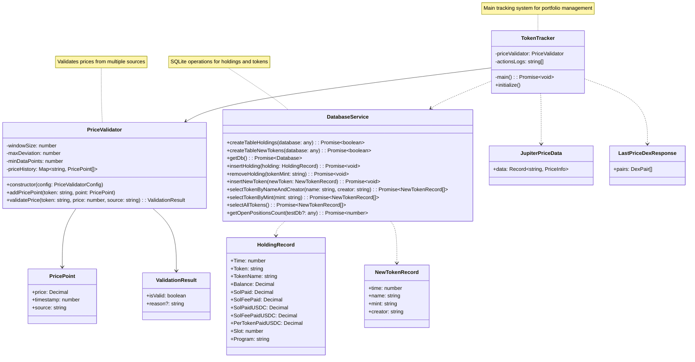

# Tracker Module Class Diagram

The diagram shows the key components of the tracker module:

1. **DatabaseService**: Handles all SQLite operations for both holdings and new token listings
2. **TokenTracker**: Main system that monitors portfolios and executes trading strategies
3. **PriceValidator**: Validates prices from multiple sources using configurable parameters
4. **Data Models**: 
   - HoldingRecord: Token position details
   - NewTokenRecord: New token listing information
   - PricePoint: Price data point with source and timestamp
   - ValidationResult: Price validation result

Key relationships:
- TokenTracker uses DatabaseService for persistence
- TokenTracker uses PriceValidator for price validation
- TokenTracker processes external price data (Jupiter, DexScreener)